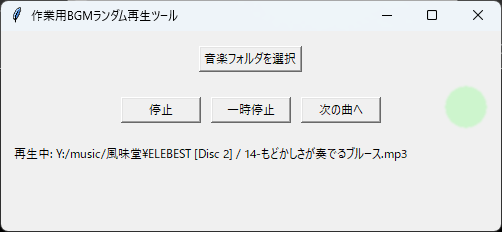

※このリポジトリは`Gemini CLI`が作成し`Claude Code`が改修しました。

# 作業用BGMランダム再生ツール (Random Music Player)

指定したフォルダ内にある音楽ファイルを、サブフォルダを含めて検索し、ランダムに再生するシンプルなGUIアプリケーションです。



## 主な機能

- **フォルダ指定**: GUI上のボタンから、音楽ファイルが保存されているフォルダを簡単に選択できます。
- **再帰的検索**: 指定したフォルダだけでなく、その中に含まれる全てのサブフォルダも自動で検索対象とします。
- **シンプルな操作性**: 「再生/停止」「一時停止」「次の曲へ」のボタンで直感的に操作できます。
- **曲情報表示**: 現在再生中の音楽ファイル名と、そのファイルが格納されているフォルダの絶対パスを表示します。
- **対応フォーマット**: `.mp3`, `.wav`, `.flac`

## 動作環境

- Python 3.x

## インストールと実行方法

#### 1. リポジトリのクローン

まず、このリポジトリをローカルマシンにクローンします。

```bash
git clone https://github.com/qack-dev/randomPlayingTool.git
cd randomPlayingTool
```

#### 2. 仮想環境のセットアップと依存関係のインストール

次に、Pythonの仮想環境をセットアップし、必要なライブラリをインストールします。

```bash
# 仮想環境を作成します
python -m venv env

# 仮想環境を有効化します (Windowsの場合)
.\env\Scripts\activate

# pipを最新版にアップグレードします
python -m pip install --upgrade pip

# requirements.txtを元に必要なライブラリをインストールします
pip install -r requirements.txt
```
*macOS/Linuxの場合は、`source env/bin/activate`で仮想環境を有効化してください。*

#### 3. アプリケーションの実行

以下のコマンドでアプリケーションを起動します。

```bash
python random_music_player.py
```

## 使い方

1.  起動後、「音楽フォルダを選択」ボタンをクリックし、再生したい音楽ファイルが入っているフォルダを選択します。
2.  音楽ファイルが正常に読み込まれると、ダイアログが表示され、「再生」「次の曲へ」ボタンが有効になります。
3.  「再生」ボタンを押すと、リストアップされた曲のランダム再生が始まります。ボタンは「停止」に切り替わります。
4.  再生中に「一時停止」ボタンを押すと、再生を一時停止できます。ボタンは「再開」に切り替わり、再度押すと続きから再生されます。
5.  「次の曲へ」ボタンを押すと、現在の曲をスキップしてリスト内の次の曲を再生します。
6.  曲が終了すると、自動的に次の曲が再生されます。

## 終了方法

アプリケーションのウィンドウを閉じた後、ターミナルで以下のコマンドを実行し、仮想環境を無効化してください。

```bash
deactivate
```

## ライセンス

This project is licensed under the MIT License.
